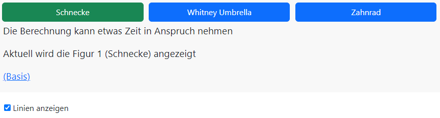
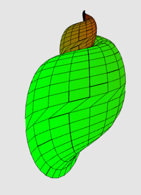
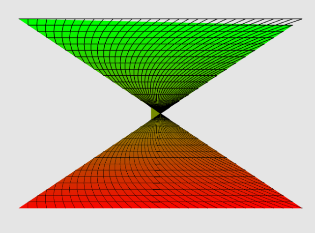
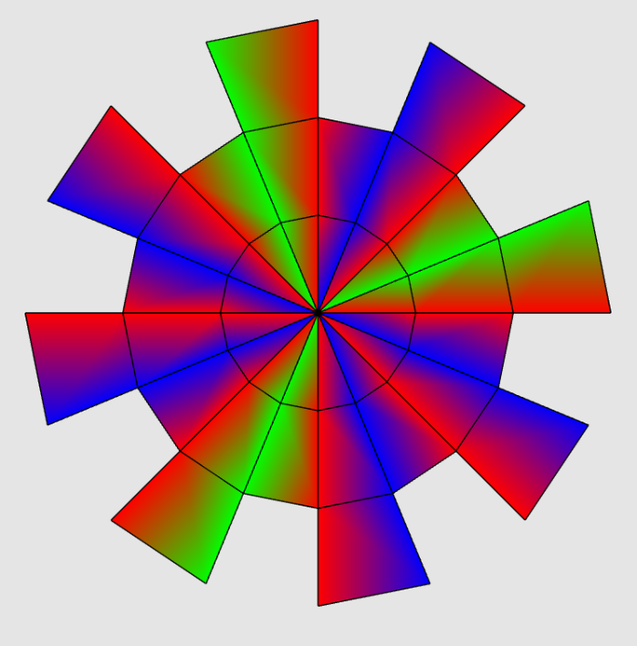

---

**Graphical Visualisation Technologies**

**Dozent: Prof. Dr. Felix Gers (Berliner Hochschule für Technik)**

**Studiengang Medieninformatik Online MA, Wintersemester 2022/23**

**University of Applied Sciences Emden/Leer, Faculty of Technology, Department of Electrical Engineering and
Informatics**

---

### Einsendeaufgabe EA4 : Eingefärbte Flächen.

[zur Webseite](https://gvt.ckitte.de/ea4/)

Im Rahmen der vierten Einsendeaufgabe sollen zunächst zusammenhängende Flächen als Gitter (Linien),  zusätzlich später mit kolorierten Flächen erzeugt und mittels WebGL dargestellt werden.

Über die drei Buttons können drei verschiedene Modelle zur Anzeige gebracht werden. Über die Checkbox kann  gesteuert werden, ob das jeweilige Modell mit einer Fläche oder nur als Gittermodell angezeigt werden soll. Zusätzlich kann über Basis die Seite der Vorlage aufgerufen Werden

Bei der Ausführung kann es zu Wartezeiten kommen, bis die Modelle durchgerechnet und zur Anzeige gebracht  werden. Insbesondere werden **CULL_FACE** und **DEPTH_TEST** eingesetzt, um Fragmente nur anzuzeigen, wenn ihre  Vorderseite sichtbar ist, oder sie verdeckt sind. Zur Anwendung kommt hier **CW (ClockWise)**. 

Um trotz der farbigen Vertices, wie sie für die Farbe der Fragmente notwendig sind, schwarze Linien zu erhalten, wurde vor deren Ausgabe das entsprechende Farbattribut disabled.

Modell 1: Schnecke

Quelle: http://www.3d-meier.de/tut3/Seite17.html

Modell 2: Whitney Umbrella

Quelle: http://www.3d-meier.de/tut3/Seite22.html

Modell 3: Zahnrad 

Das Zahnrad basiert auf einer Übung im Modul zur Ausgabe eines Spinnennetzes.

### Aufteilung des Codes

Als Startseite dient wie üblich eine **index.html**. Die Datei **main.css** enthält alle benötigten Klassen, um die Grafik einfach einzubinden. In der Datei **layout.css** wird das Layout der Webseite selbst festgelegt. Daneben kommt Bootstrap für die Buttons zum Einsatz.

Die Logik verteilt sich auf mehrere JavaScript Dateien, welche von **main.js** genutzt werden. WebGL selbst und der Shadercode befinden sich in den Dateien **webglconfig.js** und **shader.js**. In der Datei **configure.js** werden die Programmeinstellungen gehalten. Die Datei **extendedvertexarray.js** handelt Arrayfunktionen und die Arrays selbst.

Der Canvas als zentrales Ausgabeobjekt wurde in der **index.html** angelegt und mit einer fixen Breite von 1000px belegt. Alle anderen Einstellungen erfolgen über CSS.
